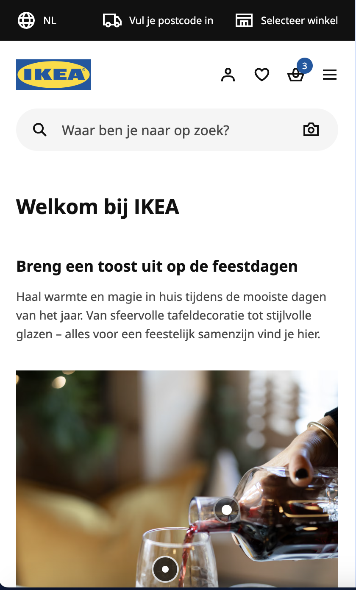
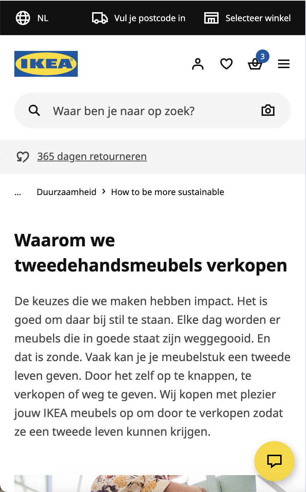
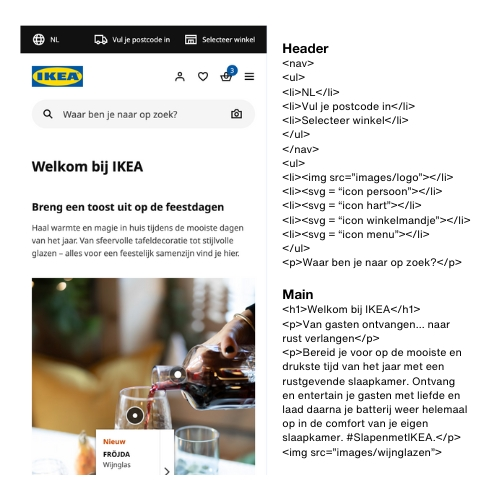
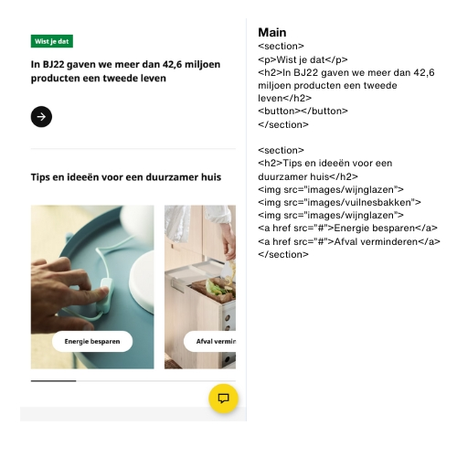
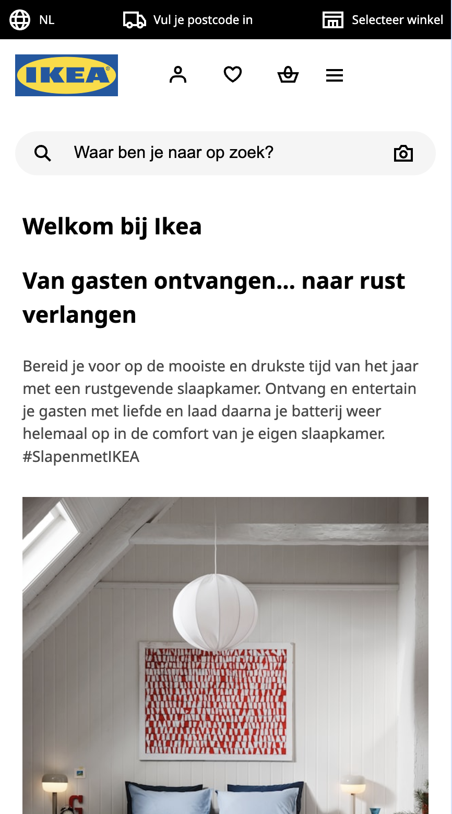
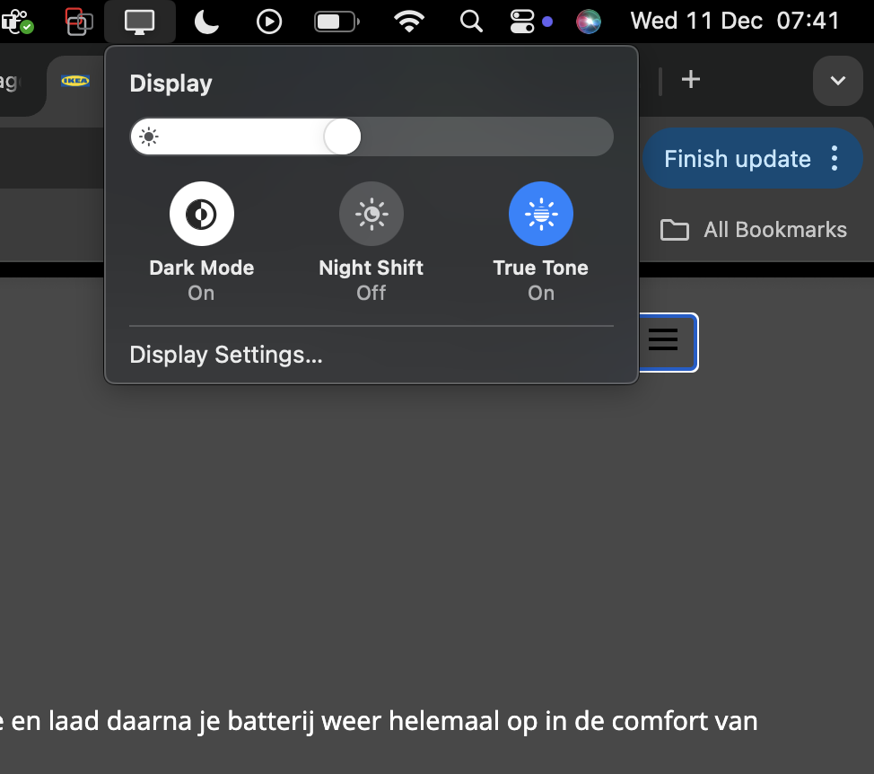
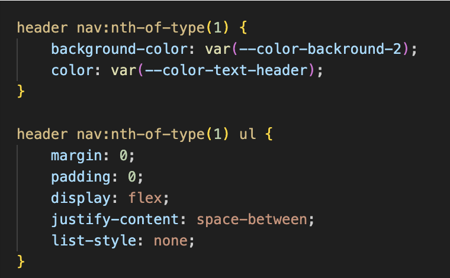
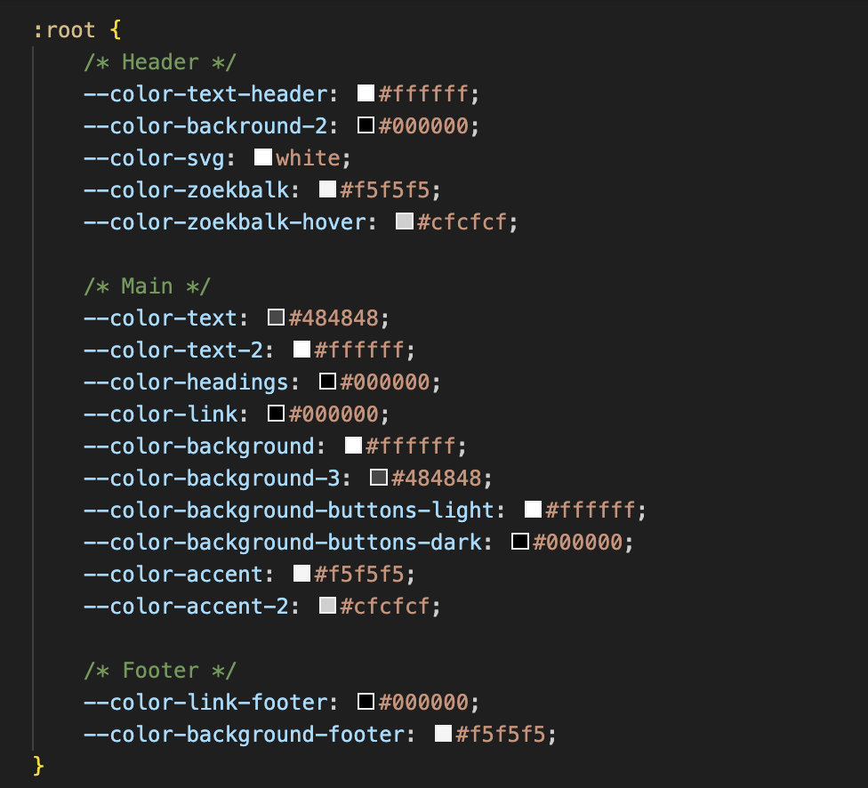
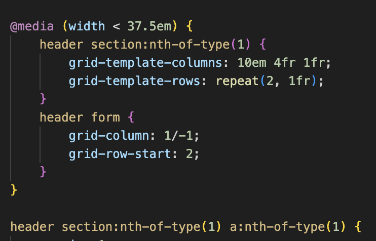
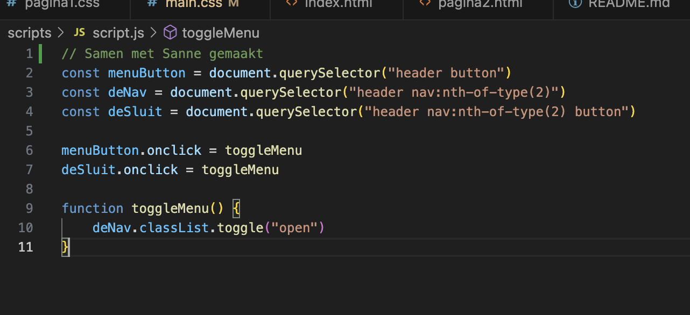

# Procesverslag
Markdown is een simpele manier om HTML te schrijven.  
Markdown cheat cheet: [Hulp bij het schrijven van Markdown](https://github.com/adam-p/markdown-here/wiki/Markdown-Cheatsheet).

Nb. De standaardstructuur en de spartaanse opmaak van de README.md zijn helemaal prima. Het gaat om de inhoud van je procesverslag. Besteedt de tijd voor pracht en praal aan je website.

Nb. Door *open* toe te voegen aan een *details* element kun je deze standaard open zetten. Fijn om dat steeds voor de relevante stuk(ken) te doen.

## Jij

  
uitwerken voor kick-off werkgroep

  ### Auteur:
  Xavannah Baars 

  #### Je startniveau:
  Mijn start niveau is rood. 

  #### Je focus:
  Ik focus op een beetje suface en voornamelijk responsive. 
 

## Je website

  
uitwerken voor kick-off werkgroep

  ### Je opdracht:
  https://www.ikea.com/nl/nl/
  https://www.ikea.com/nl/nl/this-is-ikea/sustainable-everyday/how-to-be-more-sustainable/waarom-we-tweedehandsmeubels-verkopen-pub88c22ef0/

  #### Screenshot van de Home pagina (small screen): 
  

  #### Screenshot van de tweedehands pagina (small screen):
  
 

## Toegankelijkheidstest 1/2 (week 1)

  
uitwerken na test in 2e werkgroep

  ### Bevindingen
  
  Positief: 
  <ul>
  <li>Alt teksten | De website had overal alt teksten bij de afbeeldingen waardoor screenreaders goed door de paginas heen kunnen lezen.</li>
  <li>Knoppen | Ze hebben knoppen die alleen verschijnen als je de screenreader gebruikt om ervoor te zorgen dat de lijsten overgeslagen worden.</li>
  </ul>
  Negatief: 
  <ul>
  <li>Ikea had geen light & dark mode | De Ikea had light en dark mode op hun website. Ze beperken hierbij erg de toegangkelijkheid van de website.</li>
  <li>Afbeeldingen | De afbeeldingen van de website schalen niet mee. Er zijn 9 variaties per afbeelding om ervoor te zorgen dat het meeschaalt. Dit zorgt voor extra geheugen op de website en is dus niet 'Milieubewust of website verantwoord' zoals sommige zeggen.</li>
  <li>Website heeft veel interactie | Voor gebruikers die de website kunnen zien is het interactief dat er veel pop ups, uitklapveldjes en  hovers zijn waar iets veranderd maar voor slechtziende gebruikers is dat niet fijn.</li> 
  </ul>

## Breakdownschets (week 1)

  
uitwerken na afloop 3e werkgroep

  ### de hele pagina: 
  

  ### dynamisch deel (bijv menu): 
  

## Voortgang 1 (week 2)

  
uitwerken voor 1e voortgang

  ### Stand van zaken
 Ik heb helaas dit voortgangsgesprek gemist maar ik ben wel zelf druk aan de slag geweest met mijn website. Ik heb de hele html en css van de eerste pagina afgemaakt en al begonnen aan mojn tweede pagina. 

Ik heb alle opdrachten die we gemaakt hebben in de eerste twee weken toegepast op mijn website. Tijdens de eerste twee weken hebben we veel nieuwe dingen behandeld en geleerd. 

## Voortgang 2 (week 3)

  
uitwerken voor 2e voortgang

  ### Stand van zaken
  Ik wil graag tijdens de voortgang bespreken waarom het niet lukte met mijn menu, hoe ik me video geimporteerd op youtube op het juiste formaat en responsive krijg en waarom mijn buttons blijven vastlopen en niet meeschalen. 

  Wat ging er goed?
  Ik heb gemerkt dat ik snel heb leren werken zonder classes en de html op de juiste manier heb kunnen aanspreken. Daarnaast ging het ook goed om met grid bepaalde layouts te maken met afbeeldingen die vervolgens zorgen voor een responsive website. 

  ### Verslag van meeting
  hier na afloop snel de uitkomsten van de meeting vastleggen

- Iframe video aanpassen | Ik heb samen met Sanne de video kunnen aanpassen doormiddel van de 'aspect ratio'. SDe ratio heb ik in css gezet waardoor ik vervolgens een mooie video kreeg die meeschaalde. 

- Uitklap menu | Zelf heb ik gsiter heel lang met een uitlkap menu lopen spelen maar het lukte maar niet. Ik heb nu met Sanne een klein begin gemaakt met css en javascript om hem vervolgens zelf mooi te laten werken en opmaken.

- Buttons | De buttons schaalde niet mee omdat ze op elkaar over liepen. Hiervoor heb ik als tip gekregen om display block te gebruiken. Inline zou er voor zorgen dat ze over de hele breedte zouden komen en dat wil ik niet. 

## Toegankelijkheidstest 2/2 (week 4)

  
uitwerken na test in 9e werkgroep

  ### Bevindingen
  Lijst met je bevindingen die in de test naar voren kwamen (geef ook aan wat er verbeterd is):
  <ul>
  <li>Screenreader | De screenreader tabt goed door mijn website door. Ik heb alle links zonder betekenis een aria label gegeven zodat de screenreader weet wat voor link het is.</li>

  <li>Light & dark mode | De website heb ik aangepast voor light en dark mode. Ik heb de achtergrond een soort donkergrijs gemaakt zodat mensen die niet tegen fel licht kunnen ook de website kunnen gebruiken.</li>
   </ul>

## Voortgang 3 (week 4)

  
uitwerken voor 3e voortgang

  ### Stand van zaken

Er ging best wel veel goed deze week. Ik heb veel vooruit gang gemaakt met de puntjes op de i te zetten om ervoor te zorgen dat de website zoveel mogelijk op die van de ikea lijkt. 

- Uitklap menu | Ik heb ervoor gezorgd dat het uitklap menu de opmaak lijkt op die van ikea met de zoekbalk en de lijst met pagina's. 

- Responsive img | Ik heb gekeken naar alle afbeeldingen en of die goed mee schaalde. Op een gegeven moment snapte ik hoe ik met media query's alle elementen op de juiste manier kon schalen. Ik ben de hele webpagina langs gegaan en steeds opgeschreven welke element versprong en op welk formaat dat gebeurde. 

  ### Agenda voor meeting
  samen met je groepje opstellen

  | Amy            | Xavannah           | 
  | ---            | ---                | 
  |  Overlay  | responsive afbeelding             | 
  | Donkere achtergond | Header padding | 
  | ...            | Footer              | 

  ### Verslag van meeting
  hier na afloop snel de uitkomsten van de meeting vastleggen

- Responsive afbeelding op pagina 2 in een grid zetten | Ik heb de afbeelding op pagina 2 succesvol in een grid geplaatst. Hierdoor is de afbeelding nu volledig responsive en past deze zich goed aan op verschillende schermformaten.

- Header padding toevoegen | Om het ontwerp netter te maken, heb ik padding toegevoegd aan de header. Dit lukte niet toen ik de hele header pakte maar wel als ik stukje voor stukje de header uit elkaar haalde waardoor er wat ruimte aan de zijkanten komt wat de ikea website ook heeft. 

- Footer schaalt niet mee | Ik heb samen met Kim gekeken waarom de footer niet meeschaalde. Ik heb nu padding toegevoegd aan beide kanten van de footer waardoor deze met het scherm mee groter worden. 

- Light & dark mode | Light en dark mode werkte niet mee. Ik snapte niet hoe je dit moest omdraaien. Met behulp van preferse heb ik nu mijn website in dark mode kunnen krijgen. Wel is het zo dat alles op een lelijke manier weergaf dus ik heb de hele root omgegooid en nu alle kleuren op de juiste manieren laten weergeven. 

## Eindgesprek (week 5)

  
uitwerken voor eindgesprek

  ### Je uitkomst - karakteristiek screenshots:
  

  ### Dit ging goed/Heb ik geleerd: 
  Korte omschrijving met plaatjes 
  Ik heb geleerd hoe ik met media querys op verschillende manieren light en dark mode kan geven aan een website. 
  
  
 Ik heb geleerd om custom properties aan te spreken en geen classes of div’s te gebruiken. Eerst was dit best wel erg wennen omdat we het niet zo aangeleerd hadden gekregen maar nu kan ik eigenlijk bijna niet anders. 
  

  Daarnaast heb ik ook geleerd hoe je een root moet toepassen in css. Het gebruiken van een root is eigenlijk een stuk handiger want dan hoef je niet kleur voor kleur aan te passen in je css.
 
 
  Ik heb ook geleerd om met grid te werken in plaats van flexbox. Met grid kan je veel makkelijker elementen op een bepaalde manieren positioneren om je opmaak te veranderen. Om een site responsive te maken is met grid werken veel eenvoudiger. 

Ook heb ik geleerd hoe je met media queries een website responsive maakt. Met de media queries heb ik op verschillende manieren me website responsive gekregen. Zoals afbeeldingen die verspringen in een grid van 2 columns naar 3 columns. Ook plaatsing van bepaalde elementen kan je veranderen door deze in de grid een andere plaats te geven. 
 

Als laatst heb ik geleerd hoe ik svgs kan importeren in mijn html en hoe je de kleuren daarvan kan aanpassen ook met light en dark mode. 

Tijdens dit vak heb ik voor het eerst niet steeds alles uitgesteld tot het laatste moment. Ik vond het echt een heel leuk vak om te volgen en vond de manier van de lesgeven en lesindeling fijn om elke week echt voortgang te kunnen maken. 

  ### Dit was lastig/Is niet gelukt:
  Korte omschrijving met plaatjes

  Van de javascript begreep ik aan het begin niks. Ik ben zelf een hele avond bezig geweest met het menu en ik kwam er maar neit uit. Toen heb ik het aan sanne gevraagd en hij gaf 7 regeltjes code waar het gelijk me lukte! Zelf heb ik wel de andere knop toevoegd maar daarvoor hoefde ik geen andere functie te maken. 
  

  Verder heb ik veel dingen gevraagd in de les zoals waarom bepaalde dingen niet werkten. Dit was vooral omdat ik niet het jusite element probeerde aan te roepen of omdat ik kleine typ fouten in me code had staan. Hierna kon ik snel zelf dingen oplossen als ik ergens niet uit kwam.

## Bronnenlijst

  
continu bijhouden terwijl je werkt

Ik heb eigenlijk geen bronnen gebruikt voor me code. Ik heb vooral veel vragen gesteld in de les. 

